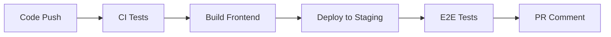
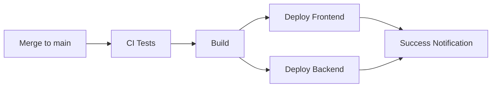

# Continuous Deployment (CD) Гарын авлага

## Тасралтгүй Хүргэлт (CD) гэж юу вэ?

Тасралтгүй Хүргэлт (Continuous Deployment) нь кодын өөрчлөлтүүд автоматаар туршилт давсны дараа production орчинд хүргэгдэх процесс юм.

## Төслийн CD Тохиргоо

### Бүтэц

```
.github/workflows/
├── ci.yml              # Тасралтгүй Интеграц
├── cd-staging.yml      # Staging орчинд deploy
└── cd-production.yml   # Production орчинд deploy
```

### Орчны ялгаа

| Үзүүлэлт | Staging | Production |
|----------|---------|------------|
| **Зориулалт** | Туршилт, QA | Бодит хэрэглэгчид |
| **Өгөгдөл** | Test өгөгдөл | Бодит өгөгдөл |
| **Deploy давтамж** | Байнга (бүх PR) | Stable код |
| **Downtime** | Асуудалгүй | Маш чухал |
| **Monitoring** | Суурь | Өндөр түвшний |

## GitHub Actions Workflows

### 1. CI Workflow (ci.yml)
Бүх кодын өөрчлөлт дээр ажиллана:
- Lint шалгалт
- Unit тестүүд
- Integration тестүүд
- Аюулгүй байдлын шалгалт
- Code coverage

### 2. Staging Workflow (cd-staging.yml)
`develop` эсвэл `staging` branch дээр push хийхэд:
- CI шалгалтууд ажиллана
- Frontend build хийгдэнэ
- Netlify staging site руу deploy хийгдэнэ
- PR comment дээр staging URL харагдана

### 3. Production Workflow (cd-production.yml)
`main` branch дээр push хийхэд:
- Бүх CI шалгалтууд давах ёстой
- Frontend Netlify production руу deploy
- Backend Railway/Render руу deploy
- Deployment статус мэдэгдэл явуулна

## Тохиргоо хийх алхмууд

### 1. Netlify тохируулах

1. [Netlify](https://netlify.com) дээр бүртгүүлэх
2. Site үүсгэх (staging болон production хоёр)
3. GitHub repository холбох
4. Build тохиргоо:
   ```
   Build command: npm run build
   Publish directory: build
   ```

### 2. GitHub Secrets тохируулах

Repository Settings → Secrets → Actions дээр дараах secrets нэмнэ:

#### Netlify
- `NETLIFY_AUTH_TOKEN` - Netlify User Settings → Applications → Personal access tokens
- `NETLIFY_SITE_ID` - Site Settings → General → Site details → API ID
- `NETLIFY_STAGING_SITE_ID` - Staging site-ийн API ID

#### Production URLs
- `PRODUCTION_API_URL` - Production backend URL
- `STAGING_API_URL` - Staging backend URL

#### Backend Deployment (сонголттой)
- `RAILWAY_TOKEN` - Railway API token
- `RENDER_DEPLOY_HOOK_URL` - Render deploy hook URL

### 3. Environment Variables

Frontend `.env` файлууд:

**`.env.production`:**
```env
REACT_APP_API_BASE=https://api.yourdomain.com
REACT_APP_ENV=production
```

**`.env.staging`:**
```env
REACT_APP_API_BASE=https://staging-api.yourdomain.com
REACT_APP_ENV=staging
```

### 4. Railway/Render Backend Deploy

#### Railway
1. [Railway](https://railway.app) дээр бүртгүүлэх
2. GitHub repository холбох
3. Environment variables тохируулах
4. Автомат deploy идэвхжүүлэх

#### Render
1. [Render](https://render.com) дээр бүртгүүлэх
2. New Web Service үүсгэх
3. GitHub repository сонгох
4. Build command: `npm install && npm run build`
5. Start command: `npm start`
6. Environment variables нэмэх

## Deployment Process

### Staging орчин



1. Developer `develop` branch дээр push хийнэ
2. CI тестүүд автоматаар ажиллана
3. Амжилттай болвол staging руу deploy хийгдэнэ
4. QA баг staging дээр туршина
5. Бүх зүйл зөв бол `main` руу merge хийнэ

### Production орчин



1. PR `main` branch руу merge хийгдэнэ
2. Бүх CI шалгалтууд давах ёстой
3. Frontend Netlify руу deploy
4. Backend Railway/Render руу deploy
5. Амжилттай deployment мэдэгдэл

## Rollback стратеги

### Netlify Rollback
```bash
# Өмнөх deploy руу буцах
netlify rollback

# Тодорхой deploy руу буцах
netlify rollback --deploy-id <DEPLOY_ID>
```

### Railway Rollback
Railway dashboard дээр өмнөх deployment сонгож "Redeploy" дарна.

### Render Rollback
Render dashboard → Deploy History → өмнөх deployment дээр "Redeploy"

## Monitoring болон Alerts

### Netlify Deploy Notifications
- GitHub commit comment
- PR comment (staging)
- Email notification (сонголттой)

### Backend Health Checks
Production орчинд health check endpoint нэмэх:

```javascript
// server.js
app.get('/health', (req, res) => {
  res.json({
    status: 'healthy',
    uptime: process.uptime(),
    timestamp: new Date().toISOString()
  });
});
```

## Best Practices

### 1. Staging дээр эхлээд туршина
✅ **Зөв:**
```
develop → staging → test → main → production
```

❌ **Буруу:**
```
develop → main → production (шууд)
```

### 2. Git Branch Strategy

```
main          - Production орчин
  ↑
develop       - Staging орчин
  ↑
feature/*     - Feature development
```

### 3. Environment-specific тохиргоо

```javascript
// config.js
const config = {
  development: {
    apiUrl: 'http://localhost:3000',
    debug: true
  },
  staging: {
    apiUrl: process.env.REACT_APP_API_BASE,
    debug: true
  },
  production: {
    apiUrl: process.env.REACT_APP_API_BASE,
    debug: false
  }
};

export default config[process.env.REACT_APP_ENV || 'development'];
```

### 4. Database Migrations

Production deploy хийхээс өмнө:
1. Staging дээр migration туршина
2. Backup авна
3. Production migration ажиллуулна
4. Success болсон эсэхийг шалгана

## Troubleshooting

### Deploy алдаа гарвал

1. **CI тестүүд алдаатай:**
   - Logs шалгана
   - Орон нутагт тестүүдийг ажиллуулна
   - Fix хийж дахин push хийнэ

2. **Build алдаа:**
   - Environment variables шалгана
   - Dependencies тооцоолно
   - Build locally туршина

3. **Deployment timeout:**
   - Build хурд сайжруулна
   - Dependencies optimize хийнэ
   - Cache ашиглана

### Logs үзэх

**Netlify:**
```bash
netlify logs
```

**Railway:**
Railway dashboard → Deployments → View logs

**Render:**
Render dashboard → Logs tab

## Дараагийн алхмууд

1. ✅ CD pipeline ажиллаж байгаа эсэхийг шалгах
2. ✅ Staging орчин дээр туршилт хийх
3. ✅ Production deploy хийх
4. 📊 Monitoring тохируулах (Sentry, LogRocket)
5. 🔔 Alert system нэмэх
6. 📈 Performance tracking (Google Analytics)

## Холбоосууд

- [Netlify Docs](https://docs.netlify.com/)
- [GitHub Actions Docs](https://docs.github.com/en/actions)
- [Railway Docs](https://docs.railway.app/)
- [Render Docs](https://render.com/docs)

---

**Санамж:** CD нь автомат процесс боловч deployment бүрийг monitoring хийх, validation үйлдлүүд нэмэх хэрэгтэй. Production дээр алдаа гарахаас урьдчилан сэргийлэхийн тулд staging орчныг үргэлж ашиглана.
